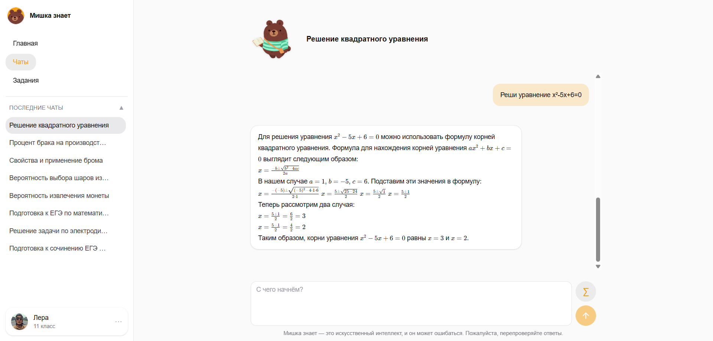
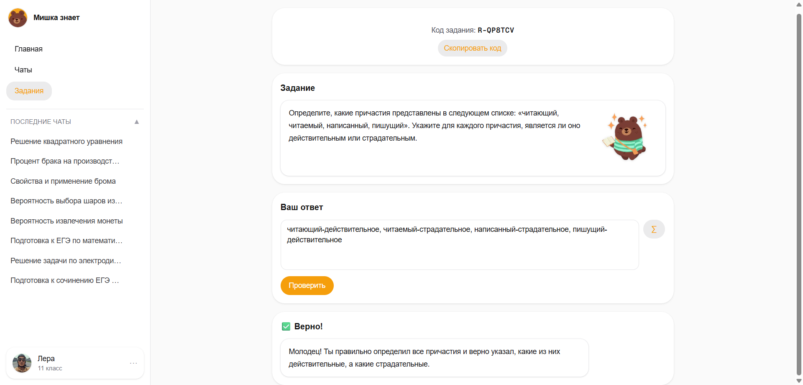
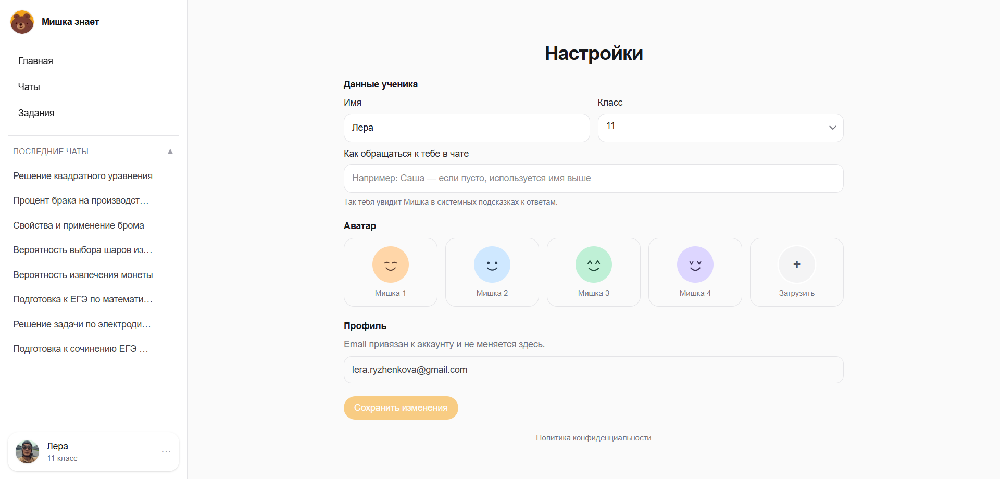

<p align="center">
  
</p>

<h1 align="center">Мишка знает</h1>


<p align="center">
  <b>Школьный ИИ-репетитор в браузере</b>: объясняет математику, физику и русский язык «по классу» (5-11), ведёт диалог и может выдать задачу с проверкой ответа.
</p>

<p align="center">
  <a href="./LICENSE"></a>
  <a href="./.nvmrc"></a>
  <a href="https://nextjs.org/"></a>
  <a href="https://www.typescriptlang.org/"></a>
  <a href="https://www.sqlite.org/"></a>
  <a href="https://orm.drizzle.team/"></a>
</p>

<p align="center">
  <b>Публичный сайт:</b> <a href="https://mishkaznaet.ru">mishkaznaet.ru</a>
</p>

---

## Содержание

- [Для кого и что умеет](#для-кого-и-что-умеет)
- [Скриншоты](#скриншоты)
- [Технологии](#технологии)
- [Как устроено](#как-устроено-коротко)
- [Переменные окружения](#переменные-окружения)
- [Продакшен на VPS](#продакшен-на-vps)
- [Локальная разработка](#локальная-разработка)
- [Команды](#команды)
- [Лицензия и безопасность](#лицензия-и-безопасность)

---

## Для кого и что умеет

- **Ученик 5–11 класса** задаёт вопросы по теме или просит разобрать условие шаг за шагом.
- **Чат с Мишкой** — отдельные беседы по предметам: математика, физика, русский или свободная тема (ИИ сам понимает предмет из формулировки). Ответ приходит потоком (как печатает собеседник). В начале диалога можно получить автозаголовок чата и уточнение предмета по смыслу сообщений.
- **Задачи** — по выбранному предмету и теме генерируется текст задачи; ученик вводит ответ и получает вердикт и разбор (в т.ч. через сравнение с эталоном и помощь модели).
- **Профиль** — имя, класс (важен для уровня объяснений), аватар (встроенные медведи, своя картинка или фото из Яндекса), обращение в чате (как зовут в ответах).
- **Вход** — регистрация по email и паролю или Яндекс ID. После первого входа через Яндекс можно пройти короткий шаг «выберите класс», чтобы подсказки совпадали с программой.

Технически это одно Next.js-приложение: страницы и API на сервере, данные в **SQLite** (Drizzle ORM), ответы чата и задач — **Google Gemini API**, сессия пользователя — **JWT** в httpOnly-cookie.

## Скриншоты

<!-- МЕСТО ДЛЯ СКРИНА: Чат по предмету -->
<p align="center">
  <br>
  <sub>Чат по выбранному предмету со стримингом ответа</sub>
</p>

<!-- МЕСТО ДЛЯ СКРИНА: Экран задачи с вердиктом -->
<p align="center">
  <br>
  <sub>Задача с проверкой ответа, вердиктом и разбором</sub>
</p>

<!-- МЕСТО ДЛЯ СКРИНА: Профиль / выбор класса и аватара -->
<p align="center">
  <br>
  <sub>Настройки профиля: класс, аватар, обращение в чате</sub>
</p>

## Технологии

<p align="center">
  
  
  
  
  
  
  
  
</p>

| Слой | Технология |
|---|---|
| Фреймворк | Next.js (Turbopack) |
| Язык | TypeScript |
| База данных | SQLite + Drizzle ORM |
| ИИ | Google Gemini API |
| Аутентификация | JWT в httpOnly-cookie, OAuth Яндекса |
| Тесты | Vitest |
| Линтинг | ESLint |

## Как устроено (коротко)

| Часть | Назначение |
|---|---|
| `middleware.ts` | Закрывает личный кабинет, чат, задачи и API без валидной cookie |
| `src/app/api/chat/*` | Сессии чата, поток ответа (SSE) |
| `src/app/api/tasks/*` | Генерация задачи, проверка ответа, история |
| `src/app/api/profile/*` | Профиль и загрузка аватара |
| `src/app/api/auth/*` | Регистрация, логин, выход, OAuth Яндекса |
| `src/lib/gemini.ts` | Запросы к Google Gemini (стрим SSE с запасным вариантом без стрима) |
| `src/lib/db/*` | SQLite, схема таблиц, создание таблиц при старте |

Если не задан `GEMINI_API_KEY`, чат и задачи работают в **демо-режиме** (локальная заглушка без вызова облака) — удобно для разработки, для продакшена ключ обязателен.

## Переменные окружения

Файл `.env.local` не коммитится. Полный перечень и комментарии — в [`.env.local.example`](./.env.local.example): ключ Gemini (`GEMINI_API_KEY`), опционально `GEMINI_MODEL`, `JWT_SECRET`, `NEXT_PUBLIC_APP_URL`, OAuth Яндекса, опционально `DATABASE_PATH`.

При компрометации ключей см. [SECURITY.md](./SECURITY.md) (ротация секретов, проверка git).

## Продакшен на VPS

- **Файл БД:** задайте `DATABASE_PATH` на каталог, который не перезаписывается при каждой выкладке новой сборки, и настройте резервное копирование файла SQLite.
- **Загрузки аватаров** пишутся в `public/uploads/avatars`. Если при деплое вы полностью заливаете папку проекта, пользовательские файлы могут пропасть — исключите этот каталог из деплоя, вынесите на симлинк или позже подключите объектное хранилище.
- **Схема БД:** сейчас удобно применять через `npm run db:push` (Drizzle Kit). Для долгой жизни продукта имеет смысл перейти на версионируемые миграции (`drizzle-kit generate` / `migrate`) и прогонять их как отдельный шаг релиза.
- **Нагрузка на API:** для одного процесса Node добавлен простой лимит по IP на `POST` к `/api/auth/login` и `/api/auth/register`. При нескольких воркерах или за reverse proxy смотрите также лимиты на уровне nginx/Caddy.

## Локальная разработка

Нужен **Node.js 22** (см. `.nvmrc`, `package.json` → `engines`).

**Windows:** запустите `start.bat` — создаст `.env.local` из примера при отсутствии, установит зависимости, проверит `better-sqlite3` (`npm run doctor:native`), запустит `npm run dev`. Сайт: [http://localhost:3000](http://localhost:3000).

**Вручную:**

```bash
npm install
npm run dev
```

Если после смены версии Node появилась ошибка `NODE_MODULE_VERSION` у `better-sqlite3`:

```bash
npm run doctor:native
```

Путь к SQLite по умолчанию (если не задан `DATABASE_PATH`): каталог в профиле пользователя, например на Windows `%LOCALAPPDATA%\tutor-ai\database.db` — так база не попадает под лишние пересборки в dev.

## Команды

| Команда | Описание |
|---|---|
| `npm run doctor:native` | Проверка/пересборка native-модуля `better-sqlite3` |
| `npm run dev` | Dev-сервер (Turbopack) |
| `npm run build` / `npm start` | Продакшен-сборка и запуск |
| `npm run lint` | ESLint |
| `npm test` | Vitest |
| `npm run db:push` | Применить схему к БД |
| `npm run db:studio` | Drizzle Studio |

## Лицензия и безопасность

- Лицензия: [MIT](./LICENSE)
- Политика безопасности и ротация секретов: [SECURITY.md](./SECURITY.md)

---

<p align="center">
  Разработано с вниманием к деталям - для тех, кто готовится к урокам.
</p>
